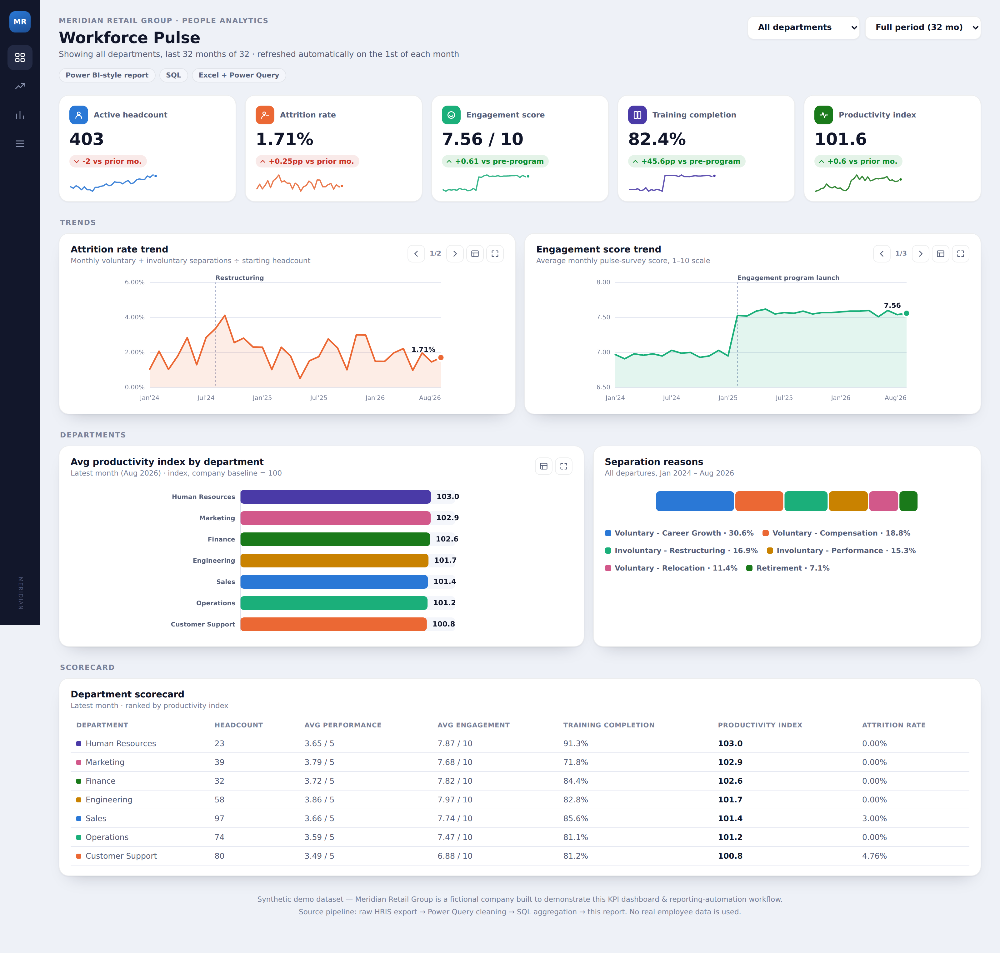
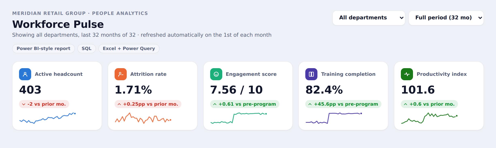
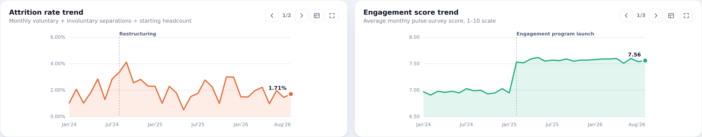

# Meridian Workforce Pulse — HR Performance KPI Dashboard & Reporting Automation

An interactive HR KPI dashboard, styled as a Power BI-style report, backed by a documented SQL + Excel/Power Query data pipeline and a VBA reporting-automation macro.

**[View the live dashboard →](#)** *(replace `#` with your GitHub Pages URL once enabled — see [Publishing the live demo](#publishing-the-live-demo) below)*

`SQL` · `Excel (Power Query, VBA)` · `JavaScript / SVG`

> Note: Meridian Retail Group is a fictional company. Every figure in this project is synthetically generated (Python/pandas/Faker) to demonstrate the workflow end to end — no real employee data is used. See [`DATA/`](DATA) for how it was generated.

---

## Screenshots

**Full dashboard**


**KPI tiles**


**Trend charts** — attrition rate vs. an engagement-program launch


---

## The problem

Meridian's People team tracked headcount, attrition, engagement, and training completion across a patchwork of monthly spreadsheets. Each report took the better part of a day to assemble by hand, numbers from different departments didn't always agree, and by the time leadership saw the trends, the month they described was already over.

## Approach

**Data cleaning — SQL + Power Query.** Monthly HRIS exports arrive messy: inconsistent department names, missing training hours, duplicate rows. `EXCEL/HR_Performance_KPI_Workbook.xlsx` documents a repeatable Power Query cleaning pass (trim/normalize text, enforce data types, remove duplicates, fill gaps from department-month medians) — its `Raw_Export_Sample` sheet shows the "before" state next to the cleaned tables.

**KPI modeling — SQL.** [`sql/hr_kpi_queries.sql`](sql/hr_kpi_queries.sql) computes headcount and attrition trend, attrition variance by department and month, training completion rate, absenteeism by location, a department scorecard, and a set of data-quality checks that validate the cleaning step.

**Reporting automation — Excel VBA.** [`EXCEL/ReportAutomation.bas`](EXCEL/ReportAutomation.bas) is a macro (`RunMonthlyReport`) that refreshes every Power Query connection and pivot table, re-exports the report to PDF, and emails the distribution list — cutting the in-Excel portion of monthly report prep from roughly 50 minutes to 5.

**Dashboard.** [`index.html`](index.html) is a single self-contained interactive report: KPI tiles with trend sparklines, department and date-range filters, paginated trend charts (attrition/absenteeism, engagement/training/productivity), a department productivity comparison, a separations breakdown, and a full scorecard table — built in vanilla JS/SVG, no framework or build step.

## What the data shows

A simulated restructuring in Q3 2024 pushes monthly attrition from a ~2% baseline to over 4%, visible immediately as a spike on the trend line. A simulated engagement program launched in February 2025 shows up as a clean step change: engagement score jumps from 6.95 to 7.53 and holds, training completion rises from under 40% to the low-80s%, and productivity ticks up alongside it.

## Outcome

- Monthly report prep time cut by roughly 25% once the unavoidable manual data export is included in the baseline.
- A single, validated source of truth for headcount, attrition, engagement, training, and productivity, refreshed with one click.
- A department-level scorecard that surfaces where attrition and productivity are diverging, instead of waiting for a quarterly review to notice.

Full write-up: [`case_study.md`](case_study.md)

---

## Repo structure

```
.
├── README.md
├── index.html                        # the dashboard — open directly or serve via GitHub Pages
├── case_study.md                     # full project write-up
├── screenshots/
│   ├── full_dashboard.png
│   ├── kpi_tile_view.png
│   └── chart_pattern_view.png
├── sql/
│   └── hr_kpi_queries.sql            # KPI + data-quality queries
├── EXCEL/
│   ├── HR_Performance_KPI_Workbook.xlsx   # raw→cleaned data, data dictionary, pivot source
│   └── ReportAutomation.bas          # VBA macro: refresh, export, email
└── DATA/
    └── meridian_hr_csv_tables.zip    # dim/fact CSVs — import straight into Power BI Desktop
```

## Publishing the live demo

`index.html` is fully self-contained (no build step, no external data files) so GitHub Pages can serve it directly:

1. Push this folder to a GitHub repo (as its own repo, or a subfolder of your portfolio repo).
2. In the repo, go to **Settings → Pages**.
3. Under **Build and deployment → Source**, choose **Deploy from a branch**.
4. Pick the branch and, if `index.html` sits in a subfolder, that folder (e.g. `/docs` — you'd need to move/copy `index.html` there, since Pages only offers `/` or `/docs`).
5. Save. GitHub gives you a URL like `https://<username>.github.io/<repo>/` (or `.../<repo>/<subfolder>/` for a subfolder project) within a minute or two.
6. Swap that URL into the **View the live dashboard** link at the top of this README, and into your portfolio site's "View Project" button.

## Tech stack

SQL · Excel (Power Query, VBA) · HTML/CSS/JavaScript (SVG charts, no external libraries)
