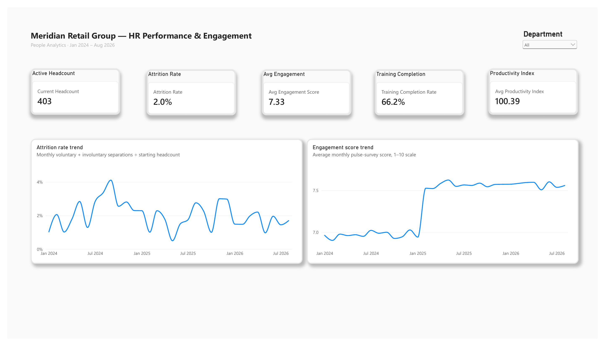
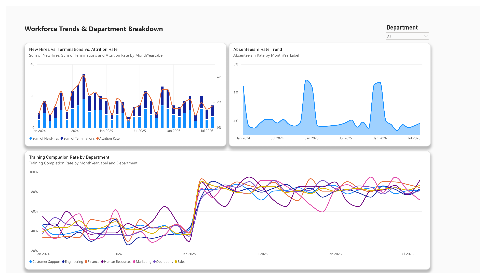

# HR Performance and Reporting Automation

I built this project to explore workforce performance in Power BI and document a repeatable monthly reporting workflow using SQL, Excel, and VBA.

The report covers headcount, attrition, engagement, training, productivity, and absenteeism. Meridian Retail Group is a fictional company, and the project uses simulated workforce data from January 2024 to August 2026.

**[Download Power BI report](pbix/Meridian_HR_KPI.pbix) · [Read case study](case_study.md) · [View SQL](sql/hr_kpi_queries.sql)**

## Power BI report previews

Both images below were exported from my Power BI Desktop report with all departments selected. They preserve the report's saved layout and measure settings.

### Overview

A summary of workforce KPIs alongside monthly attrition and engagement trends. The cards use their own measure definitions; they should not all be interpreted as latest-month values.

### Workforce Trends

Hiring, terminations, attrition, absenteeism, and training completion in one view. The department filter supports a closer look at individual teams.

## What I worked on

- Prepared workforce data and documented a Power Query cleaning workflow.
- Used SQL to calculate HR metrics and define data-quality checks.
- Built Power BI pages and DAX measures for workforce analysis.
- Included an Excel VBA routine for refreshing reports and exporting a PDF.
- Documented the model, report setup, and limitations of the analysis.

## Project files

| Resource | Contents |
| --- | --- |
| [Power BI report](pbix/Meridian_HR_KPI.pbix) | Native Power BI Desktop report |
| [Case study](case_study.md) | Project approach, observations, and limitations |
| [SQL queries](sql/hr_kpi_queries.sql) | KPI calculations and data-quality checks |
| [Excel workbook](EXCEL/HR_Performance_KPI_Workbook.xlsx) | Data preparation and reporting workbook |
| [VBA module](EXCEL/ReportAutomation.bas) | Refresh, PDF export, and optional email routine |
| [Original dataset](DATA/) | Dataset files from the original project |

## Open the report

Use the tabs to explore Overview, Workforce Trends, Department Scorecard, and Attrition & Exits.

To refresh the report on another computer, download the CSV files from powerbi/data and update any local source paths in Power Query. Review the active filters and measure definitions before comparing Power BI values with SQL or the browser dashboard.

Review the active filters and measure definitions before comparing Power BI values with SQL.

## Reporting automation

The Excel VBA routine is designed to refresh workbook connections and pivot tables, update the report date, and export a PDF summary. It requires the supplied workbook configuration and a compatible Excel environment. Power BI refresh is handled separately.

## Scope

Personal analytics project by Jaydipsinh Gohil. Built with simulated workforce data for a fictional company. Observed changes illustrate the dataset's scenarios rather than proven business results.
